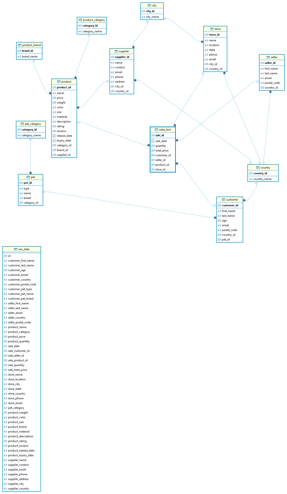

# Что было сделано?

Для импортирования таблиц в базу данных был написан bash-скрипт, который выполняется при запуске docker compose. Он вставляет данные из csv в таблицу
```raw_data```.

Для преобразования общей таблицы в модель данных снежинка был реализован sql скрипт (тоже выполняется при запуске).

# Получившаяся структура:

Факт:
- sale — факт продажи.

Измерения:
- customer — покупатель.
- seller — продавец.
- product — товар.
- store — магазин.
- supplier — поставщик.
- country — страна (используется в customer, seller, store, supplier).
- pet — питомец покупателя.
- product_category — категория товара.
- product_brand — бренд товара.

# ER-диаграмма:


